*Note: screenshots are taken on linux but they should look mostly the same on windows*

## contents

- [Setting up VS Code](#setting-up-vs-code)
- [Installing pygubu designer](#installing-pygubu-designer)

# Setting up VS Code


1. Open up Vscode.

   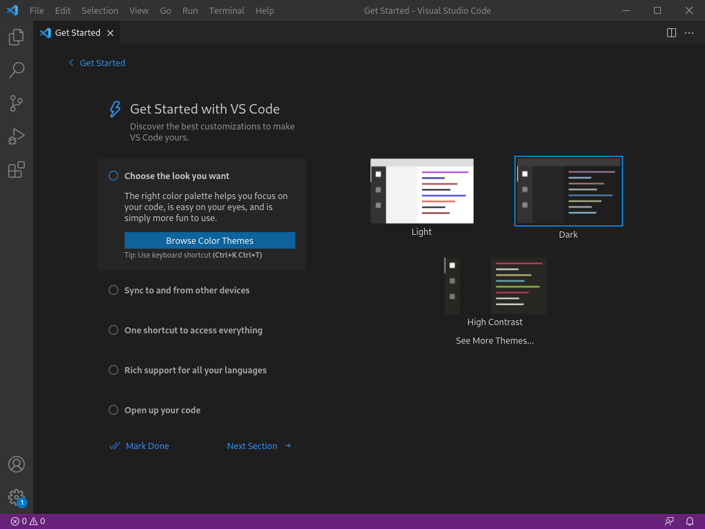

2. On the Activity Bar click on the Extensions `Ctrl+Shift+X` icon
   and install the Python Extension. *Note: this step requires an internet connection so must be done before an examination begins.*

   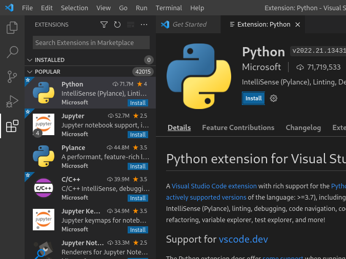

3. Go on **File > Open Folder...** `Ctrl+K Ctrl+O`.
   
   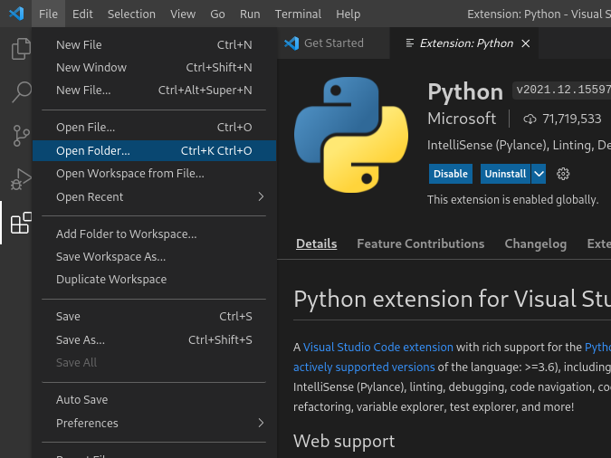

4. Trust the workspace.
   
   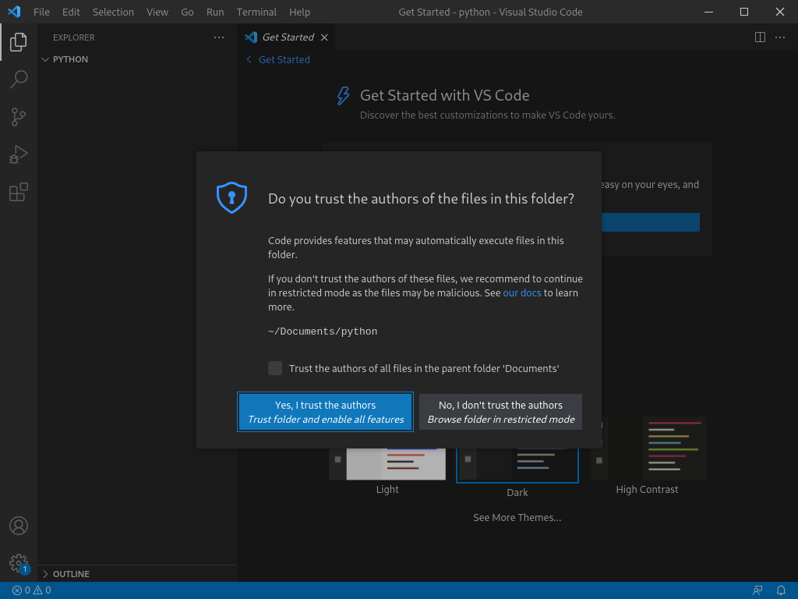

5. On the File Explorer Toolbar click on **New File...** . Name this file `hello.py`.
   
   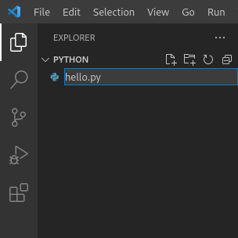

6. Type in `print("Hello World!)`.
   
   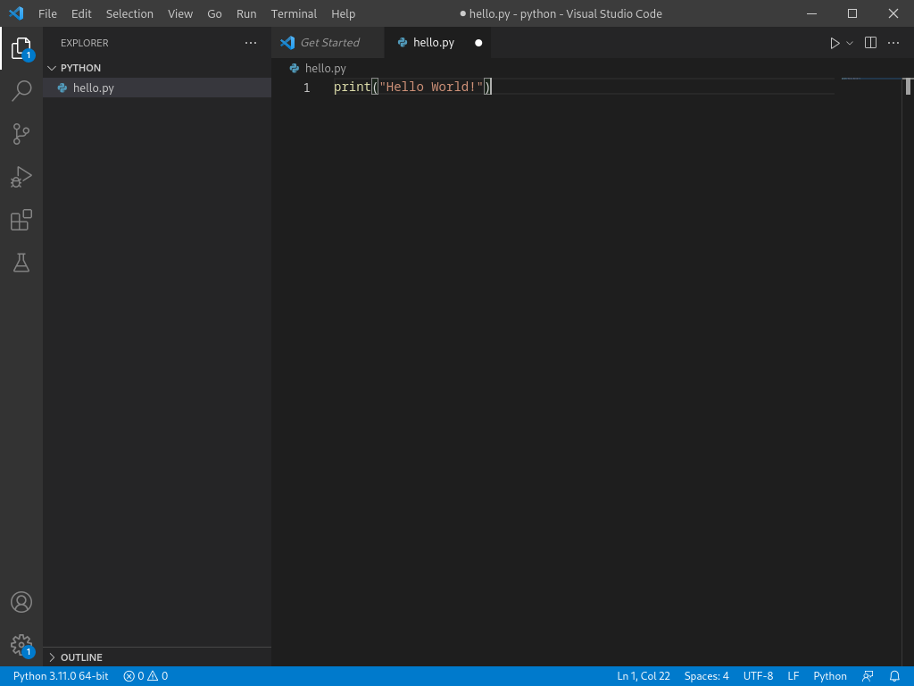

7. Go on **Run > Add Configuration... > Python File**.
   
   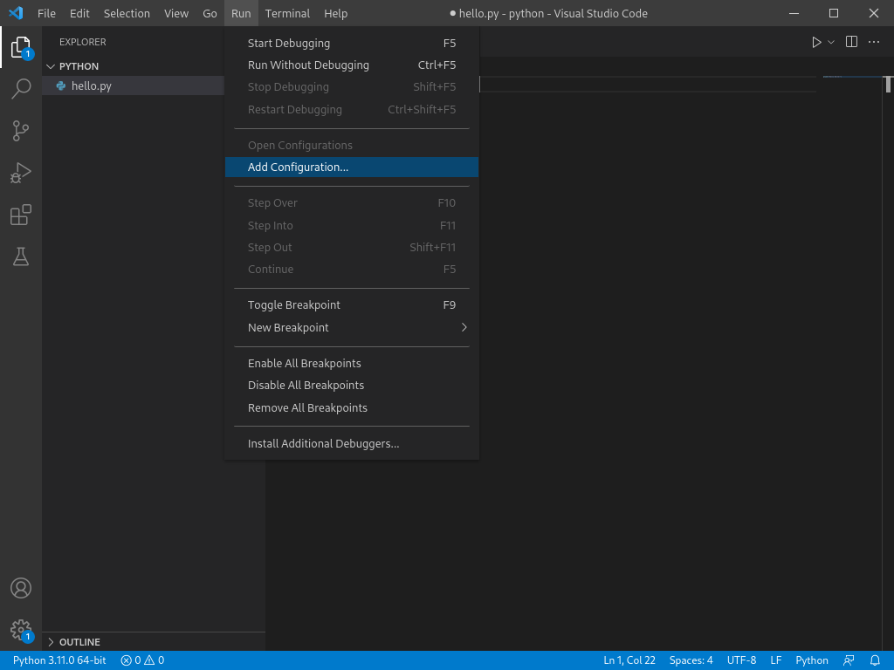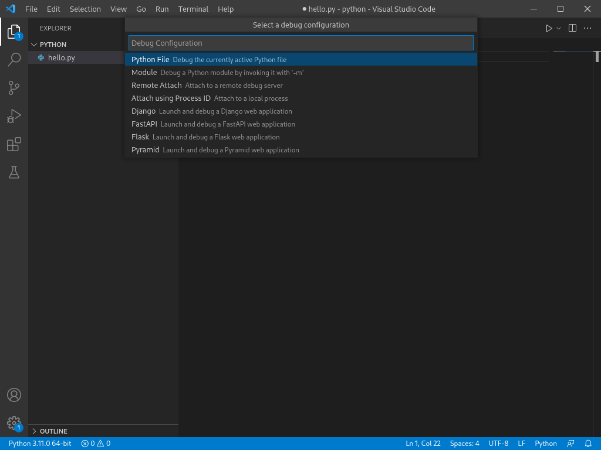

8.  Change the `"console"` field so it shows `"externalTerminal"`. Use `Ctrl+Space` whilst typing to bring up IntelliSense, and use `Tab` or `Enter` to accept the suggestion.
    
   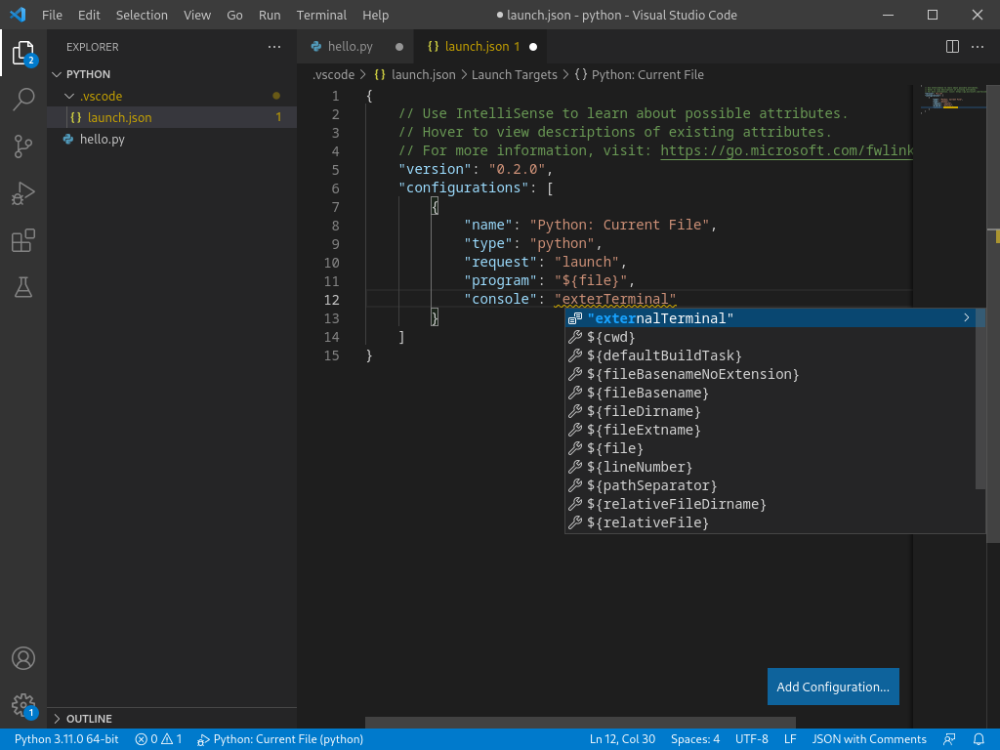

9.  Go back to `hello.py` or use  `Alt+1` / `Ctrl+Tab` to cycle between tabs.

    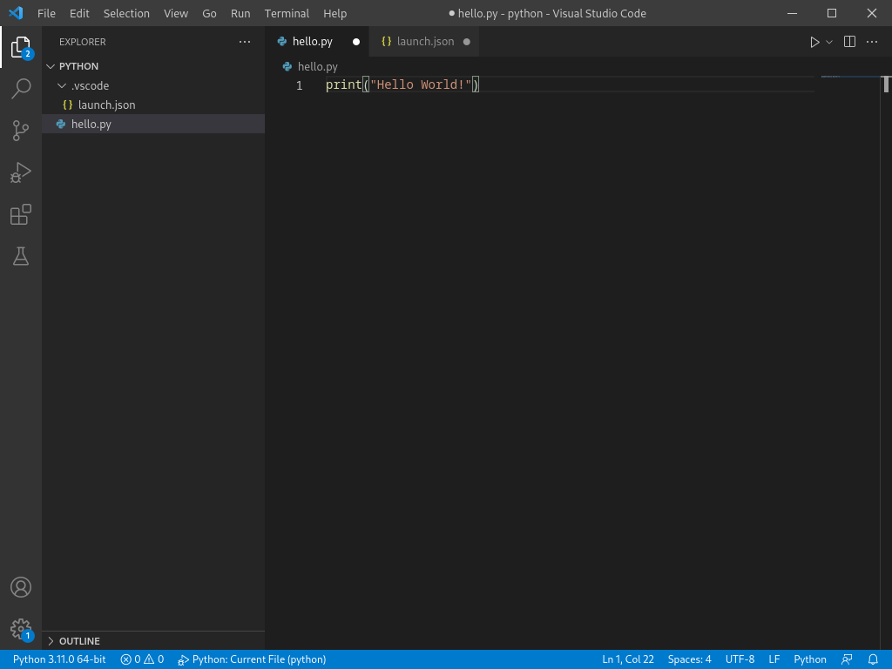

10. Go on **Run > Run Without Debugging** `Ctrl+f5`.
    You should be greeted with a terminal pop up saying `Hello World!`.

    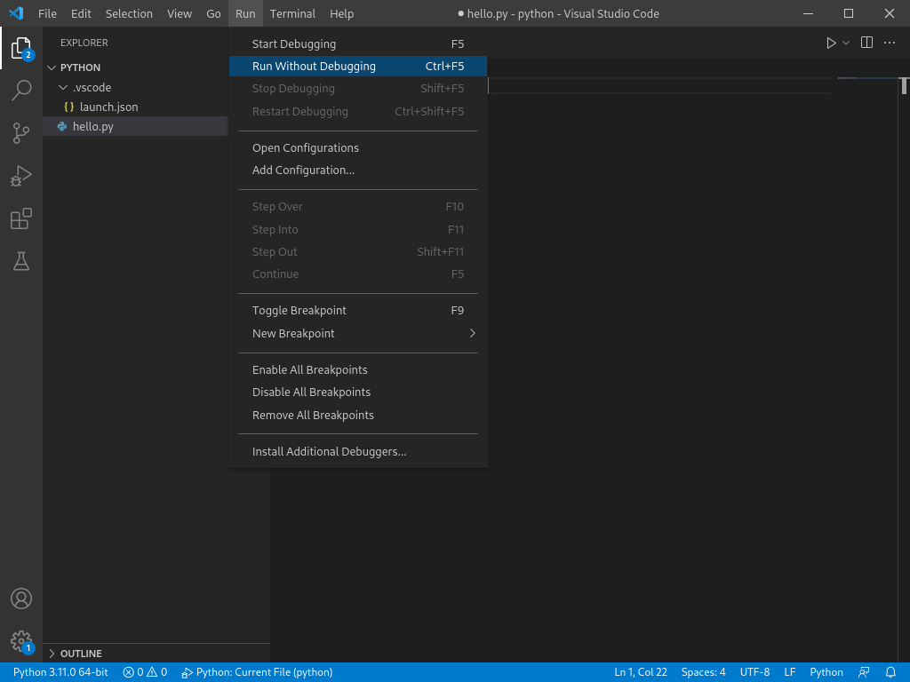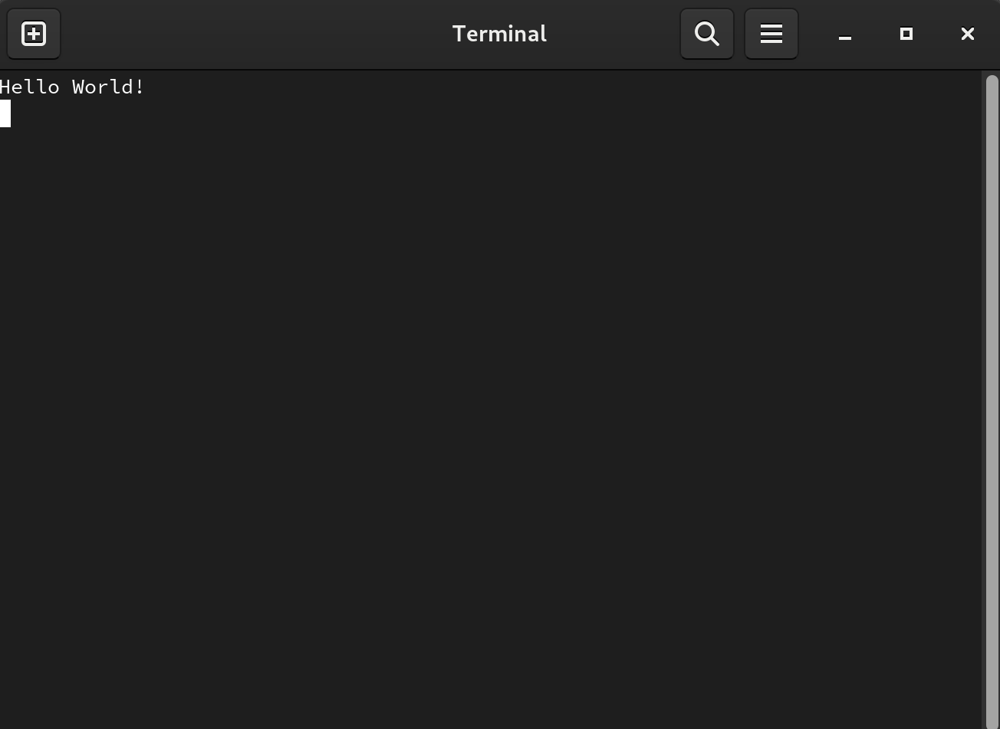

# Installing pygubu designer

1. Run the command `pip install pygubu pygubu-designer` from the start menu. You should briefly see a command prompt window flash
   
   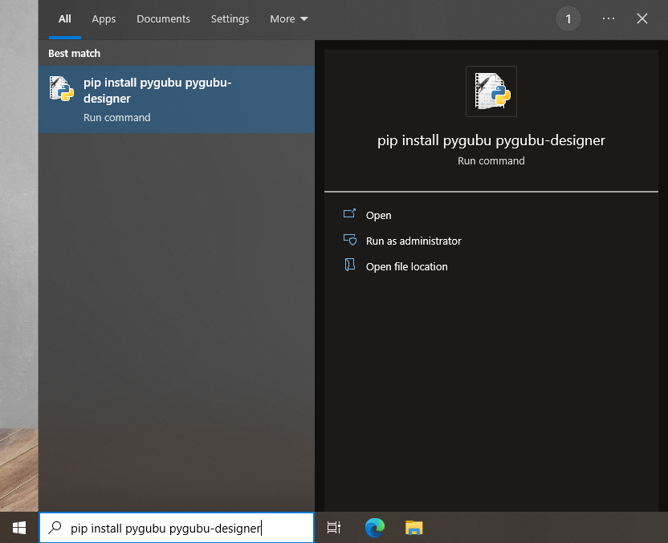
   
2. To run pygubu designer either do `python -m pygubudesigner` from the start menu
   
   

   Or alternatively create and run a new python file containing the following code

   ```python
   from pygubudesigner import main
   main.start_pygubu()
   ```

   Afterwards Pygubu Designer should open

   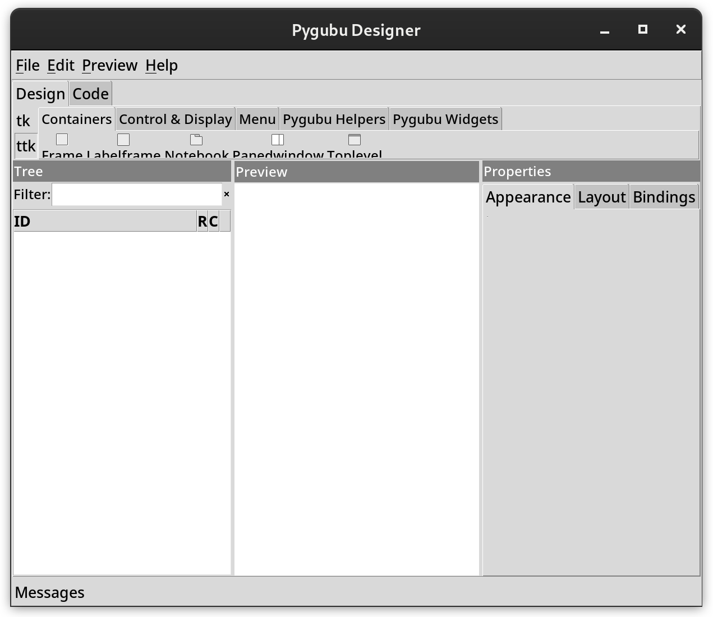