# How to setup vscode on a school computer
*10/12/2022 This is done on Linux but the process on windows should be the same*  

Open up Vscode
 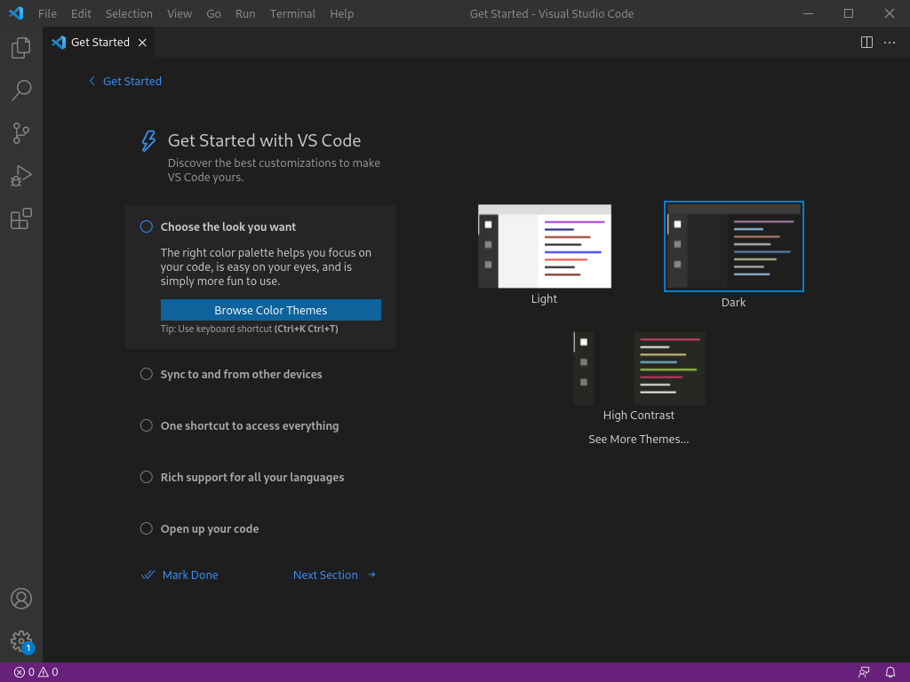  

On the Activity Bar click on the Extentions `Ctrl+Shift+X` icon
and install the Python Extention.
 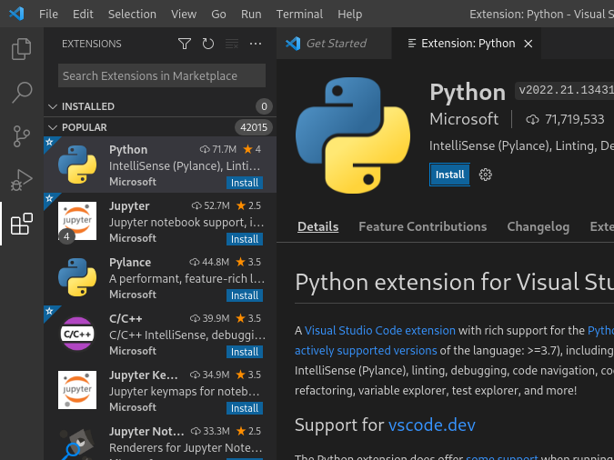  

Go on **File > Open Folder...** `Ctrl+K Ctrl+O`
 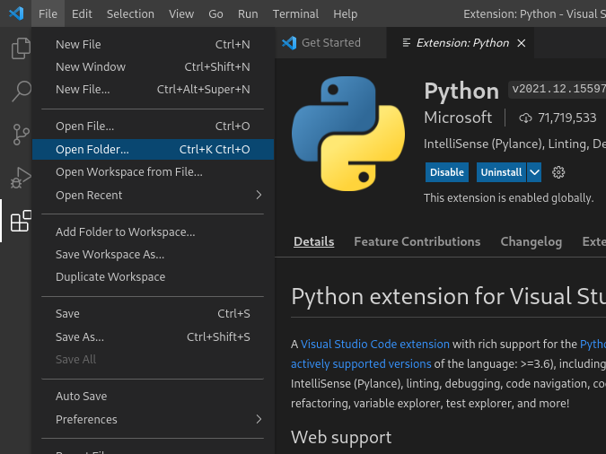

Trust the workspace
 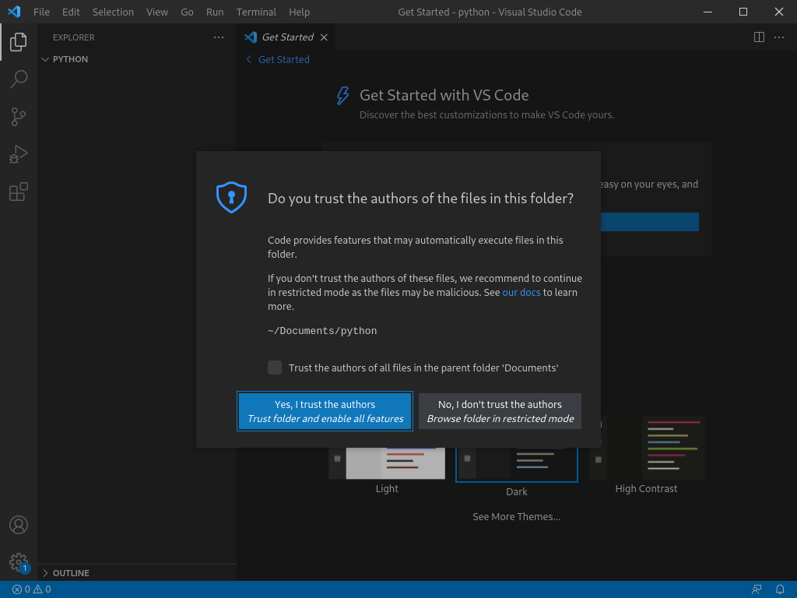  

On the File Explorer Toolbar click on **New File...** . Name this file `hello.py` 
 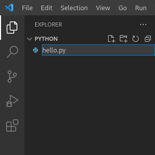  

Type in `print("Hello World!)`
 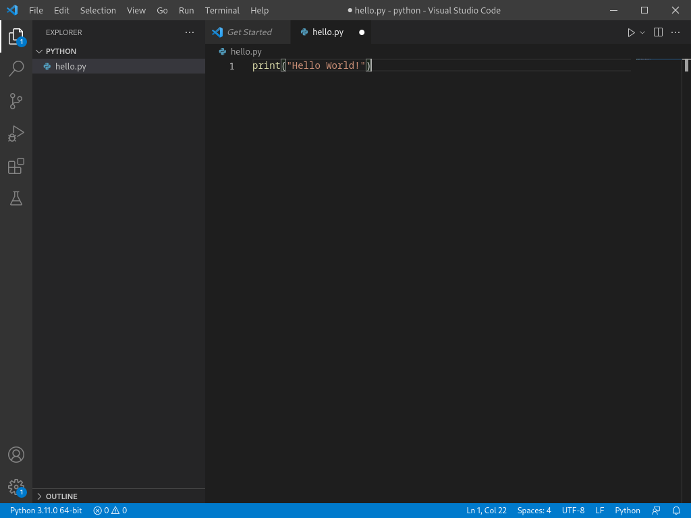  

Go on **Run > Add Configuration... > Python File**
  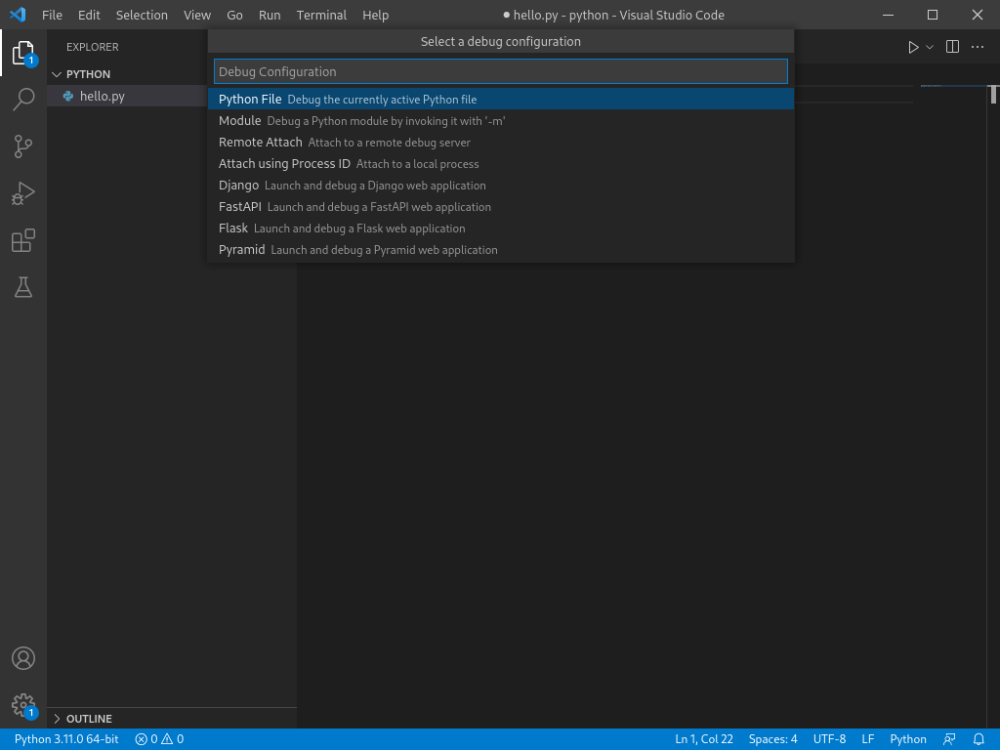  

Change the `"console"` field so it shows `"externalTerminal"`. Use `Ctrl+Space` whilst typing to bring up IntelliSense, and use `Tab` or `Enter` to accept the suggestion.
 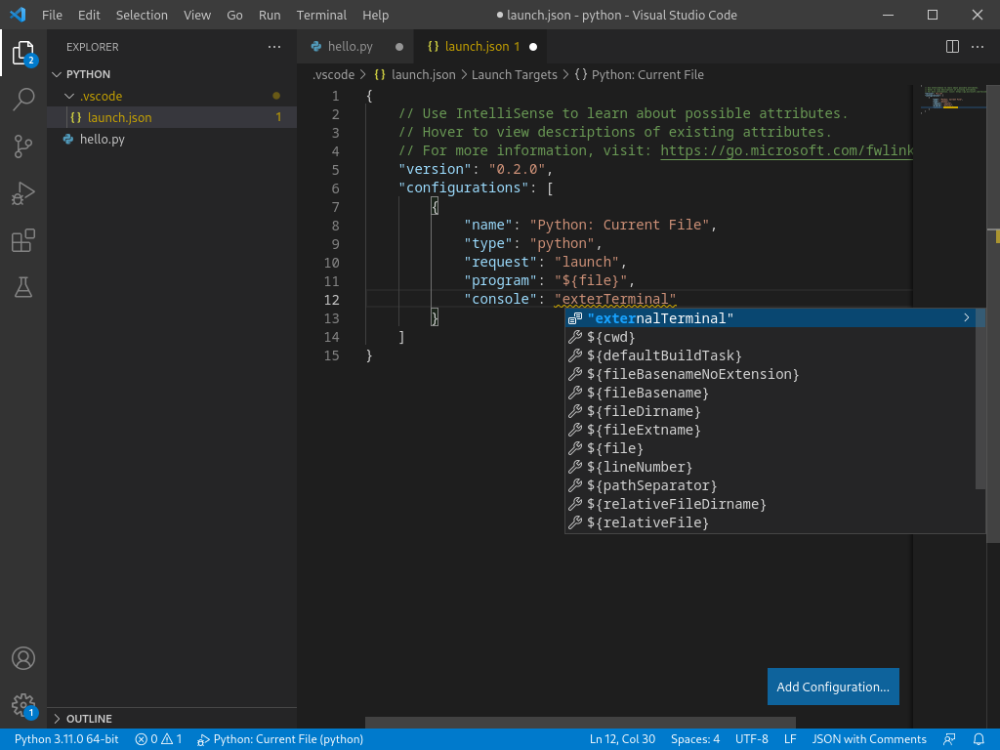  

Go back to the `hello.py` file. 
 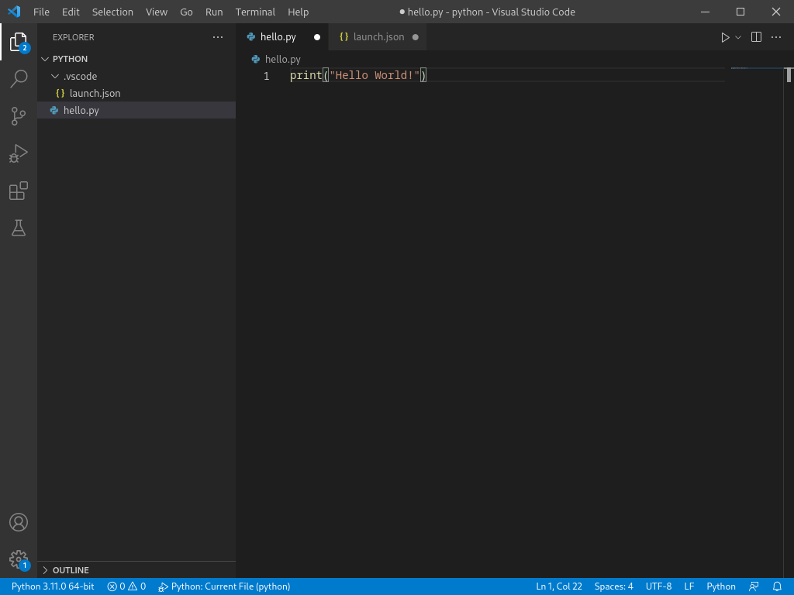  

Go on **Run > Run Without Debugging** `Ctrl+f5`.
 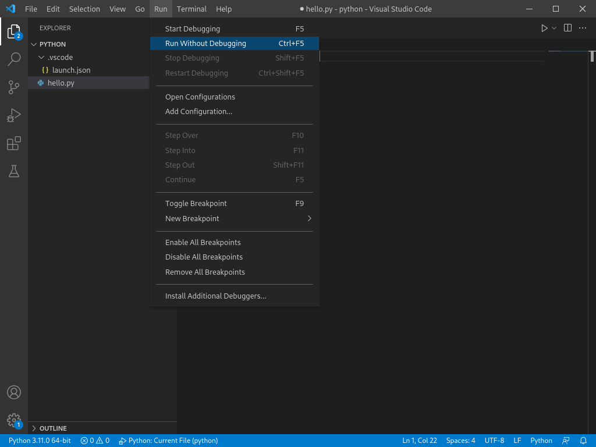  

A terminal windows should pop up saying `Hello World!`
 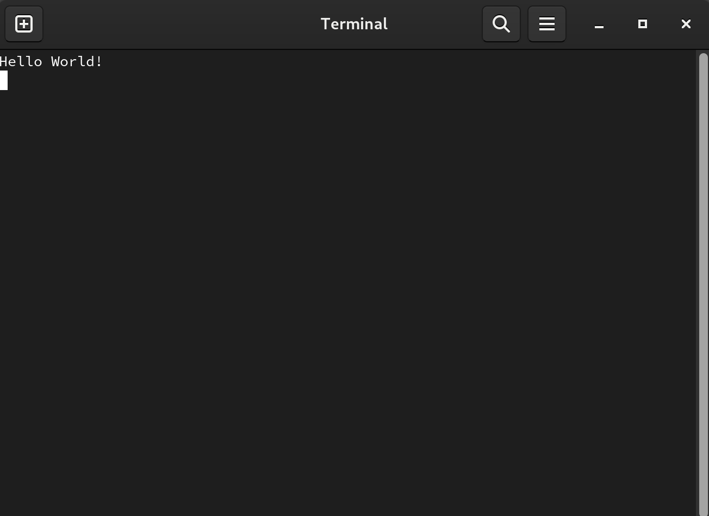
