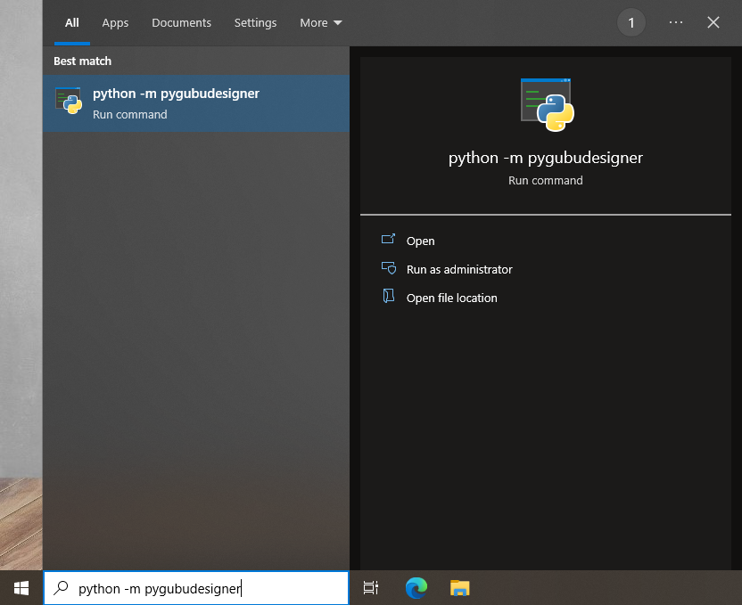

## contents

- [Dastan](#dastan)
- [Setting up VS Code](#setting-up-vs-code)
- [Installing pygubu designer](#installing-pygubu-designer)


# Dastan

<!-- Q5 dastan wiki https://en.wikibooks.org/wiki/A-level_Computing/AQA/Paper_1/Skeleton_program/2023#Question_5 -->

1. At the beginning of the game allow each player to enter their own name instead of `Player One` or `Player Two`  

   <details>
	 <summary>View Solution</summary>

	 ```python
	 class Dastan:
	   def __init__(self, R, C, NoOfPieces):
		   self._Board = []
		   self._Players = []
		   self._MoveOptionOffer = []
		   self._Players.append(Player(input("Player One enter name: "), +1))  ##
		   self._Players.append(Player(input("Player Two enter name: "), -1))  ##
		   ...
	 ```
   </details><br>
2. Add a new move called `TibbleCross`. This move allows a piece to move up two spaces diagonally.
   <details>
	 <summary>View Solution</summary>
   
	```python
	def __CreateMoveOptionOffer(self):
		self._MoveOptionOffer.append("tibblecross")
		self._MoveOptionOffer.append("jazair")
		...

	def __CreateTibbleCrossMoveOption(self, Direction):
		NewMoveOption = MoveOption("tibblecorss")
		NewMove = Move(2 * Direction, 2 * Direction)
		NewMoveOption.AddToPossibleMoves(NewMove)
		NewMove = Move(2 * Direction, -2 * Direction)
		NewMoveOption.AddToPossibleMoves(NewMove)
		NewMove = Move(-2 * Direction, 2 * Direction)
		NewMoveOption.AddToPossibleMoves(NewMove)
		NewMove = Move(-2 * Direction, -2 * Direction)
		NewMoveOption.AddToPossibleMoves(NewMove)
  		return NewMoveOption
	
	def __CreateMoveOption(self, Name, Direction):
		if Name == "tibblecross":
			return self.__CreateTibbleCrossMoveOption(Direction)
		if Name == "chowkidar":
		...

	def __CreateMoveOptions(self):
		self._Players[0].AddToMoveOptionQueue(self.__CreateMoveOption("tibblecross", 1))
		...
		self._Players[1].AddToMoveOptionQueue(self.__CreateMoveOption("tibblecross", -1))
		...
	 ```
   </details><br>

$$\begin{bmatrix}
\mathrm{X}& &   & & \mathrm{X} \\
          & &   & &            \\
          & & * & &            \\
          & &   & &            \\
\mathrm{X}& &   & & \mathrm{X}
\end{bmatrix}$$
  
-  This move should appear first in the queue

-  To test this move the piece from the co-ordinate "22" to "44" 


# Setting up VS Code
*Note: screenshots are taken on linux but they should look mostly the same on windows*

1. Open up Vscode.

   

2. On the Activity Bar click on the Extensions `Ctrl+Shift+X` icon
   and install the Python Extension. *Note: this step requires an internet connection so must be done before an examination begins.*

   

3. Go on **File > Open Folder...** `Ctrl+K Ctrl+O`.
   
   

4. Trust the workspace.
   
   

5. On the File Explorer Toolbar click on **New File...** . Name this file `hello.py`.
   
   

6. Type in `print("Hello World!)`.
   
   

7. Go on **Run > Add Configuration... > Python File**.
   
   

8.  Change the `"console"` field so it shows `"externalTerminal"`. Use `Ctrl+Space` whilst typing to bring up IntelliSense, and use `Tab` or `Enter` to accept the suggestion.
    
   

9.  Go back to `hello.py` or use  `Alt+1` / `Ctrl+Tab` to cycle between tabs.

    

10. Go on **Run > Run Without Debugging** `Ctrl+f5`.
    You should be greeted with a terminal pop up saying `Hello World!`.

    

# Installing pygubu designer

1. Run the command `pip install pygubu pygubu-designer` from the start menu. You should briefly see a command prompt window flash
   
   
   
2. To run pygubu designer either do `python -m pygubudesigner` from the start menu
   
   

   Or alternatively create and run a new python file containing the following code

   ```python
   from pygubudesigner import main
   main.start_pygubu()
   ```

   Afterwards Pygubu Designer should open

   